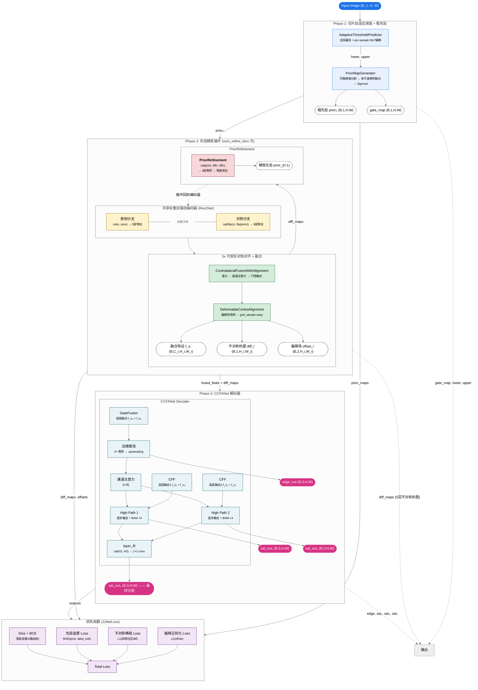

# JJNet 网络架构图

---

## 数据流简要说明

| 阶段 | 关键操作 | 输入 → 输出 |
|------|---------|-------------|
| **Phase 1** | `AdaptiveThresholdPredictor` → `PriorMapGenerator` | 图像 → per-sample 阈值 + 粗先验图(0~1概率图) |
| **Phase 2** | 编码器(共享权重) → 可变形对齐 → PriorRefinement (循环) | 粗先验 + 图像 → 精炼先验 + 5层融合特征 + 5层不对称热图 |
| **Phase 3** | GateFusion → CFF → 边缘路径 + 双High Path → BAM融合 | 5层特征 → edge_out + 3路显著性图 |
| **Loss** | Dice+BCE + MSE先验 + L1稀疏 + L2偏移正则 | 深度监督输出 + 中间产物 → 总损失 |

## 形状说明

- 蓝色椭圆 — 输入
- 粉色椭圆 — 输出
- 蓝框 — Phase 1 模块
- 黄框 — 编码器
- 绿框 — 对齐/融合
- 红框 — 先验精炼
- 紫框 — 损失函数
- 虚框 — 中间张量